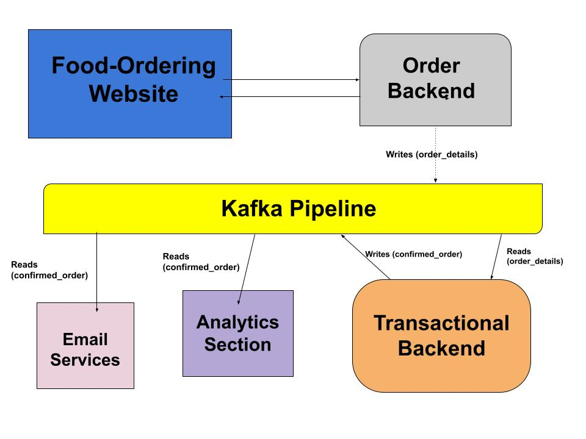

# zaap_foo
A scalable, event driven food ordering app.

### 🚩 ABSTRACT
<details>
  <summary>Click to expand!</summary>

This project aims to create the necessary infrastructural backend to handle multiple orders and transactions. It also has the facility for providing the business team with real time analytics capabilities.

Kakfa streaming pipeline is used for managing and working with multiple data streams, and is used for handling real-time orders and transaction.
</details>


## ⚒️ How it Works



* When the client places an order on the website, their request is noted down in the `Order Backend`.
* These orders are them send to the `order_details` topic of the kafka pipeline, from where they can be used for further processing by other services.
* There is the `Transactional Backend` where all the orders are comfirmed upon the successfull transaction. Once the transaction is complete, the confirmed orders can now be used for the purpose of providing multiple services. 
* At the moment there are 2 services(non-functional), Analytics and Email, which give a sence into how streaming data can be used for real-time analysis, processing etc.

## 💻 Installation

`!!! Having a running Docker Daemon is a must. !!!` <br>
You can go ahead and get your Docker Engine from the official [Docker Website](https://docs.docker.com/engine/install/)

### Initializing

```console
$ git clone https://github.com/Neelaksh-Singh/zaap_foo.git
$ cd zaap_foo/
$ docker-compose up
```
The project will now have a running Kafka and Zookeeper instance needed for the Kafka Pipeline.

### Runnig Consumers and Producers

#### Setup your Virtual environment
```
python -m venv <venv_name>
source <venv_name>/bin/activate
pip install -r requirements.txt 
```
`** Each of the seperate files mentioned below, must be started in an individual terminal **` <br>

#### Start Consumers and Producers

Go to Consumer directory within `zapp` folder and simply start your service

```
$ cd zapp/Consumer
$ python3 <file_name>
```
Now we run the `Transactional backend` which serves both as the consumer of orders and producer for confirmed order.
```
python3 transaction.py
```
Finally we are set for our orders😍.
```
$ cd zapp/Producer
$ python3 order.py
```

## 🤝 Contributing

If you are interested in contributing to the project:

- Start by reading the [Contributing Guidelines](CONTRIBUTING.md).
- Navigate the codebase and [open issues](https://github.com/Neelaksh-Singh/zaap_foo/issues).

I am thankful for all the contributions and feedback this project receives.

## 🚀 FUTURE PLANS

1. Add Web-portal for the frontend section.
2. Finding ways to host services.
3. Improving the analytics section by adding better usecases.
4. Possibly include a CI/CD pipeline.

## 📚 Reference and Resources
1. [Kafka Python](https://kafka-python.readthedocs.io/en/master/)
2. [Docker Image](https://hub.docker.com/u/confluentinc)


